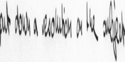
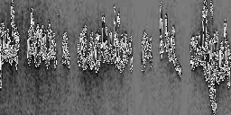
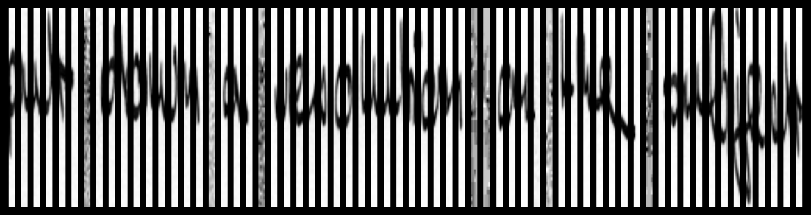

OCR with Vision Transformer (ViT) 

# Overview :pushpin: 
This project implements a Vision Transformer for Optical Character Recognition (OCR) system for handwritten text recognition. The model achieves a Character Error Rate (CER) of less than 10% on the validation set, demonstrating strong performance in transcribing handwritten text.

## Data Processing :gear:
1. First we have initial picture    

2. Then we resize picture to shape (128 x 256)    

3. We calculate mean and std over all dataset beforehand. We further normalize each instance using these statistics    

4. Transformer encoder expects a sequence. For ViT we split this image into patches of shapes (128 x 4) which are further flattened        

## Training :hammer:
1. Download the dataset running the script load_handwritten_dataset.py
2. Make sure you have c++ build tools installed. You can install them [here](https://visualstudio.microsoft.com/ru/downloads/)
3. Make sure you have PyTorch with cuda installed. You can install them [here](https://pytorch.org/get-started/locally/)
4. Edit the training notebook (e.g. changing environmental variables, training config, etc.) and run training

## Inference examples :checkered_flag:
...
