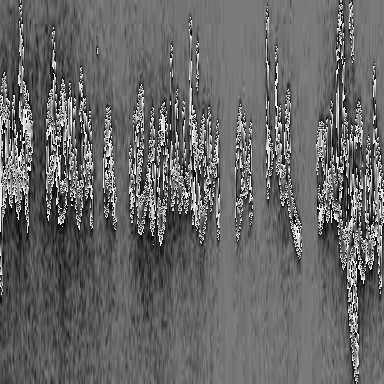

OCR with Vision Transformer (ViT) 

# Overview :pushpin: 
This project implements a Transformer Encoder-decoder architecture for learning purposes. In this project I also finetune a pretrained tr-ocr model for names recognition task to get some hands-on experience with training. 

## Data Processing of trocr model :gear:
1. First we have initial picture

2. We then use trocr processor to transform the picture

## Training :hammer:
1. Download the dataset running the script load_handwritten_dataset.py
2. Make sure you have c++ build tools installed. You can install them [here](https://visualstudio.microsoft.com/ru/downloads/)
3. Make sure you have PyTorch with cuda installed. You can install them [here](https://pytorch.org/get-started/locally/)
4. Edit the training notebook (e.g. changing environmental variables, training config, etc.) and run training

## Inference examples :checkered_flag:
...
